# str0m Browser Integration Tests

End-to-end WebRTC integration tests for [str0m](https://github.com/algesten/str0m), exercising **ICE**, **DTLS**, **SCTP**, and **DataChannel** negotiation between a Rust server and real browsers (Chrome, Edge, Firefox). All sessions are packet-captured and analyzed to count **round-trip times (RTTs)** — making this the primary observatory for measuring the connection-setup improvements delivered by **[WARP](https://docs.google.com/document/d/1vppO3GzhQ1dkKzBN_olr4O9VML58eX2P70Hb_8hLc5w)** (WebRTC Abridged Roundtrip Protocol).

## The Problem: 6 RTTs to Open a Data Channel

The current WebRTC connection setup ([RFC 8829](https://datatracker.ietf.org/doc/rfc8829/)) incurs **4 RTTs** before media can be sent and **6 RTTs** before the data channel opens. Five separate protocols are stacked and serialized:

| # | Protocol | Purpose | Handshake | RTTs |
|:-:|----------|---------|-----------|:----:|
| 1 | **Signaling** (e.g. HTTP) | SDP offer/answer exchange | 1 flight | 1 |
| 2 | **ICE** ([RFC 8445](https://datatracker.ietf.org/doc/rfc8445/)) | Find a viable transport path | Connectivity checks | 1 |
| 3 | **DTLS 1.2** ([RFC 6347](https://datatracker.ietf.org/doc/rfc6347/)) | Secure the transport | 4-way handshake | 2 |
| 4 | **SCTP** ([RFC 4960](https://datatracker.ietf.org/doc/rfc4960/)) | Reliability layer over DTLS | 4-way handshake | 2 |
| 5 | **DCEP** ([RFC 8832](https://datatracker.ietf.org/doc/rfc8832/)) | Map data channels to SCTP streams | Piggybacks on data | 0 |
| | | | **Total** | **6** |

In 2011, this wasn't much worse than the 4 RTTs needed for a WebSocket over TCP/TLS. Today, compared to QUIC's ([RFC 9000](https://datatracker.ietf.org/doc/rfc9000/)) 0-RTT setup, it seems incredibly slow — especially as WebRTC shifts from peer-to-peer calls (where human answer latency masks setup time) to **client-server** use cases (conferencing, game streaming, AI services, robotics) where every RTT is directly observable.

## WARP: From 6 RTTs to 2

**WARP** — the [WebRTC Abridged Roundtrip Protocol](https://docs.google.com/document/d/1vppO3GzhQ1dkKzBN_olr4O9VML58eX2P70Hb_8hLc5w) (Uberti & Hancke, 2025) — is a set of three orthogonal, backwards-compatible optimizations that can be mixed and matched:

| Optimization | What it Does | RTT Savings |
|---|---|:---:|
| **SNAP** | SCTP was designed as L4 with anti-hijack/DDoS mechanisms (cookie exchange). Under DTLS these are redundant. SNAP removes the SCTP 4-way handshake entirely, exchanging init params declaratively via SDP. | **−2 RTT** |
| **SPED** | Extends STUN messages with a DATA attribute to piggyback DTLS records on ICE connectivity checks, allowing the first DTLS flight to occur *concurrently* with STUN. | **−1 RTT** |
| **DTLS 1.3** ([RFC 9147](https://datatracker.ietf.org/doc/rfc9147/)) | Reduces the DTLS handshake from 2 RTTs to 1 RTT. Combined with SPED, this single RTT is absorbed into the ICE exchange. | **−1 RTT** |
| **WARP** (all three) | SNAP + SPED + DTLS 1.3 combined | **−4 RTT** |

This repo captures pcaps from every test permutation so we can **observe and quantify** these improvements as str0m and browsers add support.

> **Note:** DTLS 1.3 is enabled by default in Chrome/Edge since Oct 2025 — the base tests already exercise it. str0m does **not** yet implement SNAP or SPED, but browsers fall back gracefully when the server doesn't support them.

## Architecture Overview

```mermaid
graph TB
    subgraph CI["GitHub Actions CI"]
        Lint["Lint (fmt + clippy)"]
        Build["Build Server<br/>(3 OS × 3 crypto backends)"]
        Test["Browser Tests<br/>(3 OS × 3 crypto × 7 test suites)"]
        Analyze["RTT Analysis<br/>(Python pcap analyzer)"]
        Lint --> Build --> Test --> Analyze
    end

    subgraph Server["Rust Server (str0m)"]
        WS["WebSocket Signaling<br/>(tokio-tungstenite)"]
        Peer["Peer Event Loop<br/>(str0m Rtc engine)"]
        Pcap["Pcap Capture<br/>(pcapng writer)"]
        WS -->|spawn| Peer
        Peer --> Pcap
    end

    subgraph Browser["Headless Browser"]
        Karma["Karma Test Runner<br/>(Jasmine)"]
        WRTC["RTCPeerConnection<br/>(browser WebRTC)"]
        DC["RTCDataChannel"]
        Karma --> WRTC --> DC
    end

    Browser <-->|"WebSocket (signaling)"| WS
    WRTC <-->|"UDP (ICE/DTLS/SCTP)"| Peer
```



## Component Model


## This Repo's Signaling & Test Flow

The test harness uses a simple JSON-over-WebSocket signaling protocol. Below shows the **browser-as-offerer** flow (the most common browser configuration):

```mermaid
sequenceDiagram
    participant B as Browser (Karma)
    participant WS as Rust Server (WebSocket)
    participant P as Rust Peer (str0m)

    Note over B,P: 1. Session Setup (WebSocket Signaling)
    B->>WS: {"type":"create", "config":{sdp_role, ice_mode, dtls_role}}
    WS-->>B: {"type":"created"}

    Note over B: createDataChannel() + createOffer()
    Note over B: waitForIceGathering()
    B->>WS: {"type":"sdp", "sdp":"<offer>"}
    WS-->>B: {"type":"sdp", "sdp":"<answer>"}
    Note over B: setRemoteDescription(answer)

    B->>WS: {"type":"ready"}
    WS-->>B: {"type":"ready"}
    Note over WS: Spawns Peer event loop (echo mode)

    Note over B,P: 2. ICE → DTLS → SCTP (on the wire, over UDP)
    Note over B,P: Exact RTT count depends on DTLS version & WARP features

    Note over B,P: 3. DataChannel Echo Test
    B->>P: "hello from browser!"
    P-->>B: "hello from browser!" (echo)
    Note over B: Assert echo matches, measure RTT ✓

    Note over B,P: 4. Teardown
    B->>WS: {"type":"destroy"}
    WS-->>B: {"type":"destroyed"}
    Note over P: Shutdown → write pcapng to disk
```



### Browser-as-Answerer Flow

When `client_sdp_role = "answerer"`, the server creates the offer:

```mermaid
sequenceDiagram
    participant B as Browser
    participant WS as Server (WS)
    participant P as Peer (str0m)

    B->>WS: create (answerer config)
    WS-->>B: created
    WS-->>B: sdp (server offer)
    Note over B: setRemoteDescription(offer)
    Note over B: createAnswer() + ICE gather
    B->>WS: sdp (browser answer)
    B->>WS: ready
    WS-->>B: ready
    Note over B,P: ICE → DTLS → SCTP → Echo (same as above)
```



## WARP Protocol Ladder Diagrams

The following diagrams are derived from the [WARP specification](https://docs.google.com/document/d/1vppO3GzhQ1dkKzBN_olr4O9VML58eX2P70Hb_8hLc5w).

### Current WebRTC Setup (6 RTTs to Data Channel)

```mermaid
sequenceDiagram
    participant O as Offerer (Browser)
    participant A as Answerer (Server)

    O->>A: SDP Offer (actpass)
    A-->>O: SDP Answer (active)
    Note right of A: RTT 1 — Signaling

    O->>A: ICE Connectivity Check
    A-->>O: ICE Response
    Note right of A: RTT 2 — ICE

    A->>O: DTLS ClientHello
    O-->>A: DTLS ServerHello
    Note right of A: RTT 3 — DTLS flight 1

    A->>O: DTLS Finished
    Note left of O: Answerer media ready (3.5 RTT)
    O-->>A: DTLS Finished
    Note right of A: RTT 4 — Offerer media ready

    O->>A: SCTP INIT
    A-->>O: SCTP INIT-ACK
    Note right of A: RTT 5 — SCTP flight 1

    O->>A: SCTP COOKIE-ECHO
    A-->>O: SCTP COOKIE-ACK
    Note right of A: RTT 6 — Offerer data ready

    O->>A: DCEP Open + "hello"
    Note left of O: Answerer data ready (6.5 RTT)
    A-->>O: DCEP ACK + "world"
```



### WARP Setup (2 RTTs to Data Channel)

With **SNAP** (SCTP params in SDP), **SPED** (DTLS piggybacked on STUN), and **DTLS 1.3** (1-RTT handshake):

```mermaid
sequenceDiagram
    participant O as Offerer (Browser)
    participant A as Answerer (Server)

    O->>A: SDP Offer (actpass, sped, snap)
    A-->>O: SDP Answer (passive, sped, snap, lite)
    Note right of A: RTT 1 — Signaling

    O->>A: ICE Check + DTLS ClientHello (via SPED)
    A-->>O: ICE Response + DTLS ServerHello/Fin
    A->>O: ICE Triggered Check
    Note right of A: RTT 2 — Offerer media/data ready

    O->>A: DTLS Finished + DCEP Open + "hello"
    O-->>A: ICE Response
    Note left of O: Answerer media/data ready (2.5 RTT)

    A-->>O: DCEP ACK + "world"
```



### WARP with ICE Lite Server (1.5 RTT server-ready)

When the server uses `a=setup:passive` + ICE Lite, it can send data as soon as the DTLS ClientHello arrives — no triggered check needed:

```mermaid
sequenceDiagram
    participant C as Client (Browser)
    participant S as Server (ICE Lite)

    C->>S: SDP Offer (actpass, sped, snap)
    S-->>C: SDP Answer (passive, sped, snap, lite)
    Note right of S: RTT 1 — Signaling

    C->>S: ICE Check + DTLS ClientHello (via SPED)
    Note right of S: Server media/data ready (1.5 RTT)

    S-->>C: ICE Response + DTLS ServerHello/Fin + DCEP Open
    Note left of C: RTT 2 — Client media/data ready

    C->>S: DTLS Finished + DCEP ACK + "hello"
    S-->>C: "world"
```



### Future: 0-RTT Resumption (1 RTT total)

DTLS 1.3 supports 0-RTT session resumption. Combined with SPED, application data can be sent concurrently with the DTLS ClientHello:


### RTT Summary


## Test Matrix

### Base Tests

Every base test verifies a full WebRTC connection by sending `"hello from browser!"` through a DataChannel and confirming the server echoes it back.

| Test Case | SDP Role | DTLS Role | ICE Mode |
|-----------|----------|-----------|----------|
| `offerer_active_lite` | Browser offers | Browser = DTLS client | Server ICE-Lite |
| `offerer_active_full` | Browser offers | Browser = DTLS client | Server ICE-Full |
| `offerer_passive_lite` | Browser offers | Browser = DTLS server | Server ICE-Lite |
| `offerer_passive_full` | Browser offers | Browser = DTLS server | Server ICE-Full |
| `answerer_active_lite` | Server offers | Browser = DTLS client | Server ICE-Lite |
| `answerer_active_full` | Server offers | Browser = DTLS client | Server ICE-Full |

### Feature Tests (SNAP / SPED / WARP)

Experimental Chromium field trials are enabled via browser flags:

| Feature | Chromium Flag | What it Does | Spec |
|---------|---------------|--------------|------|
| **SNAP** | `WebRTC-Sctp-Snap/Enabled/` | Removes SCTP 4-way handshake; init params exchanged in SDP | [draft-hancke-tsvwg-snap](https://datatracker.ietf.org/doc/draft-hancke-tsvwg-snap/) |
| **SPED** | `WebRTC-IceHandshakeDtls/Enabled/` | Piggybacks DTLS ClientHello inside STUN Binding Request | [draft-okonkwo-ice-dtlsice](https://datatracker.ietf.org/doc/draft-okonkwo-ice-dtlsice/) |
| **WARP** | Both flags combined | SNAP + SPED + DTLS 1.3 = 2 RTT setup | [WARP spec](https://docs.google.com/document/d/1vppO3GzhQ1dkKzBN_olr4O9VML58eX2P70Hb_8hLc5w) |

Each feature test runs `offerer` and `answerer` variants against ICE-Lite.

> **ICE Lite is RECOMMENDED for WARP servers** (per the WARP spec): a Lite server can respond immediately to a SPED-tunneled DTLS ClientHello without waiting for its own connectivity check, enabling the 1.5-RTT server-ready path.

### CI Matrix


The full CI runs **~63 test jobs** (after exclusions for platform-specific crypto backends and browser compatibility).

## Project Structure

```
├── .github/workflows/
│   └── browser-tests.yml          # CI: lint → build → test → analyze
├── scripts/
│   └── analyze_pcaps.py           # Post-test RTT analysis & charts
├── src/
│   ├── bin/server.rs              # CLI entry point (clap)
│   ├── lib.rs                     # Session state, DtlsCert cache, port allocator
│   ├── server.rs                  # WebSocket signaling handler
│   ├── client.rs                  # WS client helpers (used by Rust tests)
│   ├── peer.rs                    # str0m Rtc event loop + pcap capture
│   ├── protocol.rs                # JSON signaling message types
│   ├── pcap.rs                    # pcapng file writer
│   └── net.rs                     # Network interface / IP detection
├── tests/
│   └── integration.rs             # Native Rust-to-Rust integration tests
├── web/
│   ├── karma.conf.js              # Karma config (base browser tests)
│   ├── karma.warp.conf.js         # Karma config (SNAP/SPED/WARP tests)
│   ├── plugins/                   # karma-str0m-server, karma-edge-launcher
│   └── src/
│       ├── protocol.ts            # TS mirror of protocol.rs
│       ├── signaling.ts           # WS client for browsers
│       ├── webrtc-client.spec.ts  # Base test suite (6 test cases)
│       └── webrtc-warp.spec.ts    # Feature test suite (6 test cases)
├── target/pcap/                   # Captured pcapng files (gitignored)
├── Cargo.toml                     # Rust deps (str0m from git)
└── package.json                   # Root npm scripts (delegates to web/)
```

## CI Pipeline

```mermaid
flowchart TD
    trigger["PR / Daily Schedule / Manual"] --> lint
    lint["Lint<br/>cargo fmt + clippy"] --> build

    build["Build Server<br/>3 OS × 3 crypto"]
    build --> |artifact: server binary| test

    test["Browser Tests<br/>63 jobs"]
    test --> |artifact: pcapng files| analyze

    analyze["RTT Analysis<br/>Python + matplotlib"]
    analyze --> |artifact: charts + markdown| report["📊 GitHub Step Summary"]

    build --> |pcapng| analyze
```



Each test job:
1. Downloads the pre-built server binary
2. Installs npm dependencies in `web/`
3. Karma launches the server via the `karma-str0m-server` plugin
4. Spawns the headless browser
5. Runs the Jasmine test suites
6. Uploads pcapng captures as artifacts

## Running Locally

### Prerequisites

- **Rust** (stable, edition 2024)
- **Node.js** 20+
- **Chrome**, **Edge**, or **Firefox** installed

### Build & Run

```bash
# Build the server
cargo build --release --bin server

# Run native Rust-to-Rust tests
cargo test --release

# Run browser tests (Chrome)
cd web && npm ci
npm run test:chrome

# Run WARP feature tests
npm run test:warp:chrome

# Analyze captured pcaps
pip install matplotlib numpy
python scripts/analyze_pcaps.py target/pcap/ --output-dir analysis
```

### Crypto Backend Selection

```bash
# Default (aws-lc-rs)
cargo build --release

# Explicit selection
cargo build --release --no-default-features --features rust-crypto
cargo build --release --no-default-features --features openssl       # Linux
cargo build --release --no-default-features --features apple-crypto  # macOS
cargo build --release --no-default-features --features wincrypto     # Windows
```

## Pcap Analysis

Every test captures a pcapng file at `target/pcap/{session_id}_{role}.pcapng`. The analysis script:

1. Parses each pcapng file (custom minimal parser matching our writer format)
2. Classifies packets: `STUN-REQ`, `STUN-RESP`, `DTLS-HS`, `DTLS-APP`, etc.
3. Counts RTTs per phase (STUN, DTLS handshake, SCTP handshake)
4. Generates a markdown summary table and PNG bar charts
5. Outputs to `$GITHUB_STEP_SUMMARY` for in-PR visibility

### Reading the RTT Table

| Session | Browser | Crypto | STUN RTTs | DTLS RTTs | SCTP RTTs | Total |
|---------|---------|--------|:---------:|:---------:|:---------:|:-----:|
| `chrome_offerer_active_lite` | Chrome | aws-lc-rs | 1 | 1 | 2 | **4** |
| `chrome_warp_offerer` | Chrome | aws-lc-rs | 1 | 0 | 0 | **1** |

Expected progression as str0m adds support:

| Milestone | Total RTTs | Breakdown | Notes |
|-----------|:----------:|-----------|-------|
| Baseline (DTLS 1.2) | **6** | 1 sig + 1–1.5 ICE + 2 DTLS + 2 SCTP | Full ICE with non-aggressive nomination |
| DTLS 1.3 | **5** | 1 sig + 1–1.5 ICE + 1 DTLS + 2 SCTP | Chrome/Edge default since Oct 2025 |
| + SPED | **4** | 1 sig + 1 ICE/DTLS + 2 SCTP | DTLS piggybacked on STUN via SPED |
| **Full WARP** | **2** | 1 sig + 1 ICE/DTLS | + SNAP removes SCTP handshake entirely |
| Future 0-RTT | **1** | 1 sig (data in first flight) | DTLS 1.3 session resumption |

> With **ICE Lite** (recommended for WARP servers), the server is ready to send at **1.5 RTT** — it doesn't need to wait for its own triggered check. Full ICE adds ~0.5 RTT to the ICE step for non-aggressive nomination.

## References

- **WARP spec** — [WebRTC Abridged Roundtrip Protocol](https://docs.google.com/document/d/1vppO3GzhQ1dkKzBN_olr4O9VML58eX2P70Hb_8hLc5w) (Uberti & Hancke, 2025)
- **SNAP** — [draft-hancke-tsvwg-snap](https://datatracker.ietf.org/doc/draft-hancke-tsvwg-snap/) — SCTP Negotiation Acceleration Protocol
- **SPED** — [draft-okonkwo-ice-dtlsice](https://datatracker.ietf.org/doc/draft-okonkwo-ice-dtlsice/) — STUN Protocol for Embedding DTLS
- **DTLS 1.3** — [RFC 9147](https://datatracker.ietf.org/doc/rfc9147/)
- **str0m** — [github.com/algesten/str0m](https://github.com/algesten/str0m)
- **WebRTC Data Channels** — [RFC 8831](https://datatracker.ietf.org/doc/rfc8831/) (the protocol sandwich, Section 5)
- **DCEP** — [RFC 8832](https://datatracker.ietf.org/doc/rfc8832/) — DataChannel Establishment Protocol

## License

See [str0m](https://github.com/algesten/str0m) for the upstream library license.